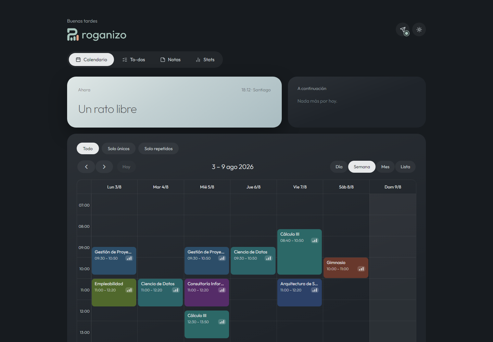

# Roganizo

**Tu asistente personal en Telegram: le hablás en lenguaje natural y te organiza el Google
Calendar, las tareas, las notas y los recordatorios.**

[](LICENSE)
[](https://uncheck4164.github.io/roganizo/)
[](#arranque-rápido-docker)
[](https://github.com/Uncheck4164/roganizo/actions/workflows/pages.yml)

<!-- Cuando se active la publicación en Docker Hub (ver docs/publishing.md), reemplazar el badge
de Docker de arriba por:
[](https://hub.docker.com/r/TODO-dockerhub-user/roganizo)
-->

[](README.md)
[](README.es.md)
[](https://buymeacoffee.com/TODO-bmc-user)

Roganizo es un asistente **mono-usuario**. Le escribís por **Telegram** como le escribirías a un
amigo y eso se convierte en eventos reales de **Google Calendar**, to-dos en **Google Tasks**,
notas y recordatorios. Incluye además una **web de solo lectura** (calendario, to-dos, notas y
stats) protegida por contraseña: toda modificación pasa por el bot, así que nadie más puede tocar
nada.



**🔗 [Demo en vivo](https://uncheck4164.github.io/roganizo/)** — la web con datos ficticios y sin
backend. El bot y la sincronización real requieren self-hosting.

## Qué sabe hacer

- 🗓 *"mi horario: lunes 8am ciencias, 9 mates, martes 3pm biología"* → eventos semanales
  recurrentes (con resumen y botones **Confirmar / Cancelar** si son 3 o más).
- *"después de biología quiero estudiar, pero antes 20 min de almuerzo"* → lee el calendario y
  crea todo encadenado.
- *"¿a qué hora me recomendás estudiar el martes?"* → analiza tus huecos libres reales.
- *"recordame la prueba el martes 28 de septiembre"* → mensaje de Telegram ese día.
- Recordatorios **urgentes** ("insistí hasta que confirme"): aviso con botón "✅ Visto"
  5 minutos **antes** de la hora y, si no confirmás, **te llama por Telegram** (CallMeBot) a la
  hora exacta.
- Detecta solapes de horario y avisa en lugar de crear a ciegas.
- Briefing cada mañana: agenda del día + to-dos + recordatorios.
- Notas y to-dos por chat; todo visible en la web.

## Arranque rápido (Docker)

Un solo contenedor: bot + API + web + scheduler. La base SQLite vive en el volumen `/data`.

### Camino A — cero configuración (recomendado)

Levantá el contenedor sin ninguna configuración y hacé todo el setup desde el navegador.

```bash
docker build -t roganizo .
docker run -d --name roganizo --restart unless-stopped \
  -v roganizo-data:/data -p 8080:8080 roganizo
```

Abrí **http://localhost:8080** y seguí el asistente guiado: token de Telegram, OAuth de Google,
API key de OpenRouter, contraseña de la web, zona horaria e idioma. El asistente trae ayuda paso
a paso para cada proveedor y guarda todo en SQLite, dentro del volumen `/data`.

> `--restart unless-stopped` no es opcional: al guardar la configuración el proceso se reinicia
> para tomar los valores nuevos, y Docker tiene que volver a levantar el contenedor.

### Camino B — con un archivo `.env`

Si ya tenés tus credenciales, podés pasarlas como variables de entorno.

```bash
cp .env.example .env   # completá tus credenciales
docker build -t roganizo .
docker run -d --name roganizo --restart unless-stopped \
  --env-file .env -v roganizo-data:/data -p 8080:8080 roganizo
```

Los dos caminos se pueden mezclar: lo que falte en el `.env` se completa después desde el
navegador, y lo que cambies en el navegador tiene prioridad.

<!-- Próximamente: imagen precompilada en Docker Hub (ver docs/publishing.md)
docker pull TODO-dockerhub-user/roganizo
-->
**Próximamente:** una imagen precompilada (`docker pull TODO-dockerhub-user/roganizo`), para no
tener ni que buildearla.

Como es un `Dockerfile` común, esto corre igual en cualquier PaaS basado en Dockerfile (Dokploy,
Coolify, Portainer, Railway, Fly.io…): apuntalo a este repositorio, montá un volumen en `/data`,
exponé el puerto **8080** por HTTPS y poné `PUBLIC_URL` con tu dominio.

## Prerrequisitos paso a paso (una sola vez)

Vas a necesitar tres cosas: un bot de Telegram, credenciales de Google y una key de OpenRouter.
Todo lo de abajo es gratis.

### 1. Bot de Telegram

1. Abrí Telegram y hablale a **[@BotFather](https://t.me/BotFather)**.
2. Mandale `/newbot`.
3. Te pide un **nombre visible**: el que quieras, por ejemplo `Roganizo`.
4. Te pide un **username**: tiene que ser único y **terminar en `bot`**, por ejemplo
   `roganizo_ramiro_bot`.
5. BotFather te responde con un **token** con pinta de `123456789:AAE...`. Copialo: ese es
   `TELEGRAM_BOT_TOKEN`.
6. Ahora conseguí tu **user ID numérico**: hablale a **[@userinfobot](https://t.me/userinfobot)**
   y mandale `/start`. Te responde con tu ID (un número tipo `123456789`). Ese es
   `TELEGRAM_ALLOWED_USER_ID`, y el bot ignora a cualquier otro usuario.

<details>
<summary><b>Opcional — llamadas telefónicas para recordatorios urgentes (CallMeBot)</b></summary>

Si querés que Roganizo **te llame por Telegram** cuando no confirmás un recordatorio urgente,
tenés que autorizar CallMeBot una sola vez:

1. Mandale `/start` a **[@CallMeBot_txtbot](https://t.me/CallMeBot_txtbot)** (es el paso de
   autorización que describe [callmebot.com](https://www.callmebot.com/blog/telegram-call-api/);
   el sitio ofrece además un link de login como alternativa).
2. Poné en `CALLMEBOT_USER` tu **@usuario** de Telegram (el público, no el ID numérico).

Dejá `CALLMEBOT_USER` vacío para desactivar las llamadas: los recordatorios urgentes siguen
funcionando, solo que se quedan en mensajes de Telegram. CallMeBot es un servicio gratuito de
terceros; si cambian el flujo de activación, seguí las instrucciones de su sitio.

</details>

### 2. Google Cloud (Calendar + Tasks)

1. Entrá a **[console.cloud.google.com](https://console.cloud.google.com)** con la cuenta de
   Google cuyo calendario querés organizar.
2. Creá un **proyecto nuevo** (barra superior → selector de proyecto → *Nuevo proyecto*).
   Cualquier nombre sirve.
3. Andá a **APIs & Services → Library** y habilitá **las dos**:
   - **Google Calendar API**
   - **Google Tasks API**
4. Andá a **APIs & Services → Credentials → Create credentials → OAuth client ID**.
5. Tipo de aplicación: **Web application**.
6. En **Authorized redirect URIs**, agregá tu callback:
   - producción: `https://TU-DOMINIO/oauth/callback`
   - desarrollo local: `http://localhost:8080/oauth/callback`

   Tiene que coincidir exactamente con `PUBLIC_URL` + `/oauth/callback`, incluyendo
   `http`/`https` y el puerto.
7. Guardá y copiá el **Client ID** (`...apps.googleusercontent.com`) y el **Client secret**
   (`GOCSPX-...`). Esos son `GOOGLE_CLIENT_ID` y `GOOGLE_CLIENT_SECRET`.
8. Andá a **OAuth consent screen** y tocá **Publish app** para sacarla de *Testing*.
   **No** hace falta que Google la verifique: sos el único usuario, y el cartel de "app no
   verificada" se pasa una sola vez con *Configuración avanzada → Ir a Roganizo*.

   > **No la dejes en *Testing*.** Mientras la pantalla de consentimiento está en Testing,
   > Google vence todos los refresh tokens **a los 7 días**, y a la semana el bot y el panel
   > web empiezan a contestar `invalid_grant` tanto en Calendar como en Tasks. Agregarte como
   > test user no lo evita.

### 3. OpenRouter (el LLM)

1. Creá una cuenta en **[openrouter.ai](https://openrouter.ai)**.
2. Andá a **[openrouter.ai/keys](https://openrouter.ai/keys)** y creá una key (`sk-or-v1-...`).
   Esa es `OPENROUTER_API_KEY`.
3. Cargá crédito, o elegí alguno de los modelos gratuitos: el default es
   `deepseek/deepseek-v4-flash-0731`, pero **funciona cualquier modelo de OpenRouter**, solo
   cambiá `OPENROUTER_MODEL` (o elegilo desde la pantalla de configuración). El modelo tiene que
   soportar tool-calling.

## Configuración

Podés configurar Roganizo de dos maneras, y se pueden combinar libremente:

- **Desde el navegador**: abrí el panel y tocá el **ícono de engranaje** para llegar a la
  pantalla de configuración. Trae ayuda paso a paso para cada proveedor y guarda los valores en
  SQLite.
- **Con variables de entorno**: un archivo `.env` (ver `.env.example`) o el panel de entorno de
  tu PaaS.

**Precedencia: UI / base de datos > variable de entorno > default.** Es decir: lo que guardes
desde la pantalla de configuración le gana a lo que diga el entorno. Al guardar, el proceso se
reinicia para tomar los valores nuevos (de ahí `--restart unless-stopped`).

La única excepción es `DATABASE_PATH`: como define *dónde vive la configuración misma*, solo se
puede setear como variable de entorno.

| Variable | Qué es |
|---|---|
| `TELEGRAM_BOT_TOKEN` | Token de @BotFather |
| `TELEGRAM_ALLOWED_USER_ID` | Tu user ID numérico — el bot ignora al resto |
| `OPENROUTER_API_KEY` / `OPENROUTER_MODEL` | LLM (default `deepseek/deepseek-v4-flash-0731`) |
| `OPENROUTER_PROVIDER_ORDER` | Providers preferidos en orden, admite variante de cuantización (default `deepinfra/fp4,baidu`) |
| `OPENROUTER_SORT` | Criterio de fallback: `price` (default), `throughput` o `latency` |
| `GOOGLE_CLIENT_ID` / `GOOGLE_CLIENT_SECRET` | Credenciales OAuth de Google Cloud |
| `PUBLIC_URL` | URL pública (OAuth callback + links que manda el bot) |
| `PORT` | Puerto HTTP (default 8080) |
| `WEB_PASSWORD` | Contraseña de la web de solo lectura |
| `WEB_SESSION_SECRET` | Secreto para firmar la cookie de sesión — **se autogenera si falta**, y se puede sobrescribir igual |
| `CALLMEBOT_USER` | Tu @usuario de Telegram para llamadas de urgencia (vacío = sin llamadas) |
| `LANGUAGE` | `es` o `en` (default `es`) — idioma del bot y del briefing matutino. La web tiene su propio toggle ES/EN |
| `TIMEZONE` | Default `America/Santiago` |
| `BRIEFING_TIME` | Hora del briefing matutino, `HH:mm` (vacío = desactivado) |
| `DATABASE_PATH` | **Solo por entorno.** Default `/data/roganizo.db` en Docker |

## Desarrollo local

```bash
pnpm install
pnpm dev               # server + bot en :8080
pnpm dev:web           # SPA con hot-reload en :5173 (proxy a :8080)
```

Abrí http://localhost:8080 y completá el setup desde el navegador, o `cp .env.example .env` y
llenalo a mano si preferís.

Primer uso: mandale `/start` al bot → te da el link para conectar Google → listo.

## Comandos del bot

- `/start` — bienvenida y conexión con Google si falta
- `/web` — link al panel
- `/duplicados` (o `/duplicates`) — busca eventos repetidos con el mismo título y horario en
  los próximos 60 días y propone dejar una sola copia de cada uno, con un solo toque
- `/diag` — una llamada real a OpenRouter: modelo, proveedor que respondió, latencia y costo
- `/reset` — borra la memoria de conversación y las confirmaciones pendientes

## Servidor MCP

`apps/mcp` le permite a un cliente MCP (Claude Code, Claude Desktop, …) leer una instancia en
vivo: eventos, to-dos, notas, recordatorios, stats, y un tool `health` que sondea todos los
endpoints y dice qué está roto. Es de solo lectura a propósito: los cambios de calendario siguen
pasando por la tarjeta de confirmación de Telegram. Setup y referencia de tools:
**[docs/mcp.md](docs/mcp.md)**.

## Cómo se confirman los cambios de calendario

Nada llega a Google Calendar sin que toques un botón:

- Cada creación, movida o borrado que decide el asistente queda **anotado**, no ejecutado. Al
  final del turno recibís **una sola tarjeta** con los cambios numerados y agrupados por día,
  con Confirmar / Cancelar.
- Antes de anotar nada, el asistente está *obligado* a leer los días afectados
  (`get_events` / `find_free_slots`) en ese mismo turno, y los ids de eventos tienen que salir
  de esa lectura: así los ids viejos ya no generan una pared de "Not Found".
- Después el plan se valida contra el calendario real: eventos que ya no existen, horarios que
  terminan antes de empezar, acciones repetidas dentro del plan, duplicados exactos y solapes
  se muestran en la tarjeta. Los errores bloquean la confirmación; las advertencias solo se
  avisan. Si algo está mal, el modelo recibe su propio plan con los problemas y tiene que
  corregirlo antes de que vos lo veas.
- Proponer un plan nuevo **anula** la tarjeta anterior, así que nunca se pueden confirmar dos
  versiones del mismo horario, que es como se duplicaban los eventos.
- Al confirmar, un evento idéntico a uno que ya está en el calendario se omite en vez de
  duplicarse, y borrar algo que ya no existe se informa como tal, no como error.

To-dos, notas y recordatorios son de menor riesgo y siguen ejecutándose al toque; borrarlos sí
pregunta antes, igual que el calendario.

## Arquitectura

```
Telegram ⇄ grammY ⇄ Agente LLM (OpenRouter, tool-calling)
                        ├─ Google Calendar (eventos, RRULE, huecos libres, conflictos)
                        ├─ Google Tasks (to-dos)
                        └─ SQLite (notas, recordatorios, historial, configuración)
Scheduler (60s) → recordatorios + briefing matutino por Telegram
Hono → /oauth/* · /api/* (solo GET, con sesión) · SPA React
```

Todo corre en un único contenedor: bot, API HTTP, web y scheduler. El bot usa long-polling, así
que no hay que configurar ningún webhook de Telegram.

## Licencia

MIT — ver [LICENSE](LICENSE).

© 2026 Ramiro Figueroa ([Uncheck4164](https://github.com/Uncheck4164)).

## Apoyar el proyecto

Si Roganizo te ahorra tiempo, podés
[invitarme un café](https://buymeacoffee.com/TODO-bmc-user) ☕. Totalmente opcional: el proyecto
es gratis, self-hosted y va a seguir siéndolo. Una estrella en el repo o un issue bien reportado
ayudan igual.
